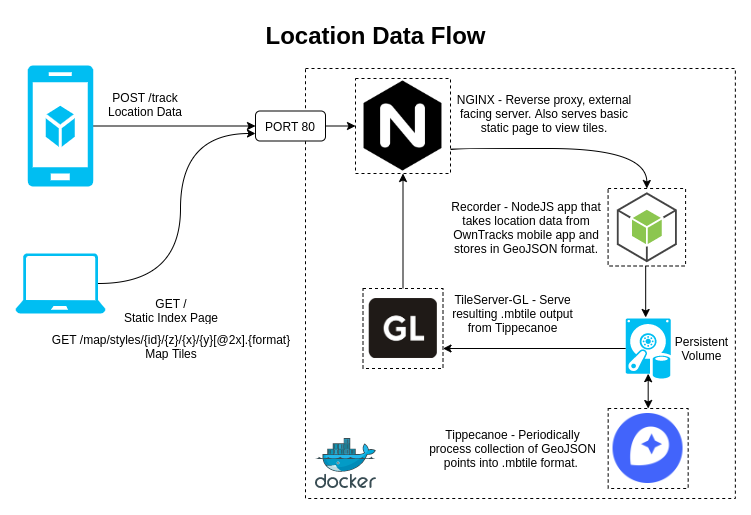

# Owntracks Tileserver
Application stack for recording and displaying locations using owntracks, tileserver-gl and tippecanoe

### [Tippecanoe](https://github.com/maptiler/tileserver-gl)
>"Build vector tilesets from large collections of GeoJSON features."
### [TileServer-GL](https://github.com/maptiler/tileserver-gl)
>"Vector and raster maps with GL styles. Server side rendering by Mapbox GL Native. Map tile server for Mapbox GL JS, Android, iOS, Leaflet, OpenLayers, GIS via WMTS, etc."
### [Owntracks](https://owntracks.org/)
>"OwnTracks allows you to keep track of your own location. You can build your private location diary or share it with your family and friends. OwnTracks is open-source and uses open protocols for communication so you can be sure your data stays secure and private."
